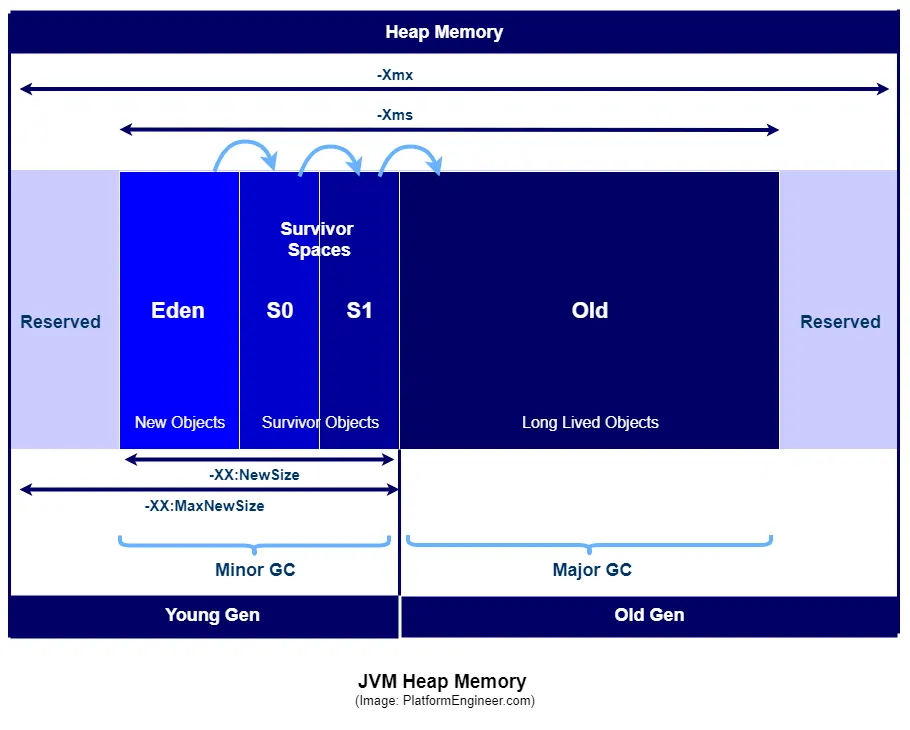

Got it ✅
I’ll rewrite the entire article into a **clean, structured Markdown version** so you can use it in docs, notes, or even publish it.
Here’s the formatted version:

---

# Understanding Java’s Garbage Collection

*By Alexander Obregon*
*Nov 3, 2023 – 9 min read*

---

## 📌 Introduction

Garbage collection (GC) is a form of **automatic memory management**.

In languages without garbage collection, programmers are responsible for manually allocating and deallocating memory. This leads to issues such as:

* **Memory leaks** → allocated memory is never freed.
* **Dangling pointers** → memory is freed while still being referenced.
* **Double freeing** → memory deallocated twice, causing corruption.

Java solves this with a **garbage collector**. The JVM automatically identifies and reclaims memory no longer in use, ensuring efficient utilization and freeing developers from manual memory management.

---

## 🔎 Introduction to Garbage Collection

GC is a feature in modern programming languages that allows developers to focus on **application logic** instead of memory allocation/deallocation.

Why GC was needed (problems with manual memory management):

* **Memory Leaks** → forgetting to free memory causes gradual memory exhaustion.
* **Dangling Pointers** → accessing prematurely freed memory leads to crashes.
* **Double Freeing** → corrupts memory and produces erratic behavior.

In automated GC:

* Programmers only allocate memory.
* The **GC decides when to free** it based on **reachability**.
* If an object is unreachable, it becomes garbage and memory is reclaimed.

In Java, the **JVM oversees garbage collection**. As objects are created and used, the JVM tracks them. Once unused, the GC reclaims their memory.

---

## 🧠 How Garbage Collection Works in Java

GC in Java is orchestrated by the **JVM**, mainly operating inside the **heap memory**.

### Java Memory Structure

* **Stack** → holds primitive data types and method calls.
* **Heap** → where objects are stored, divided into:

  * **Young Generation**

    * New objects created here.
    * Subdivided into:

      * **Eden**
      * **Survivor Spaces (S0, S1)**
  * **Old Generation (Tenured)**

    * Objects surviving multiple GC cycles move here.
  * **Metaspace (or Permanent Generation in older JVMs)**

    * Stores class metadata.

---

### Lifecycle of Garbage Collection

1. **Object Creation**

   * New objects go into **Eden space**.
   * When Eden fills, a **Minor GC** is triggered.

2. **Minor Garbage Collection**

   * Cleans Eden, deletes unused objects.
   * Survivors are moved to **S0 or S1**.
   * After multiple cycles, long-lived objects move to **Old Generation**.

3. **Major (Full) Garbage Collection**

   * Works on **Old Generation**.
   * More costly and slower.
   * Reclaims memory from long-lived, unused objects.

4. **Reachability → Mark & Sweep**

   * GC starts from **root objects** (threads, static fields, etc.).
   * **Mark phase** → identifies reachable objects.
   * **Sweep phase** → deletes unreachable objects.

5. **Compaction**

   * Rearranges memory to reduce fragmentation.
   * Ensures large contiguous memory blocks are available.

---

## ⚙️ Types of Java Garbage Collectors

### 1. **Serial Garbage Collector**

* **Mechanism**: Single-threaded for both minor and major GC.
* **Best For**: Small heaps, single-threaded apps.
* **Pros/Cons**: Minimal overhead, but noticeable pauses.

---

### 2. **Parallel (Throughput) Garbage Collector**

* **Mechanism**: Multi-threaded young generation GC.
* **Best For**: Medium/large heap, multi-threaded server apps.
* **Pros/Cons**: High throughput, but full GC pauses can be long.

---

### 3. **CMS (Concurrent Mark-Sweep) Collector**

* **Mechanism**: Concurrent marking & sweeping with minimal pauses.
* **Best For**: Low-latency applications.
* **Pros/Cons**: Reduced pauses but higher overhead + fragmentation issues.

---

### 4. **G1 (Garbage-First) Collector**

* **Mechanism**: Heap divided into **regions**, collects garbage-heavy regions first.
* **Best For**: Large heaps, multi-core servers.
* **Pros/Cons**: Predictable pause times, less fragmentation, but requires fine-tuning.

---

### 5. **ZGC & Shenandoah**

* **Mechanism**: Ultra-low latency collectors with millisecond pause times.
* **Best For**: Real-time, trading systems, AR/VR apps.
* **Pros/Cons**: Very low pauses, scalable for huge heaps, but relatively newer.

---

## ✅ Best Practices for Java Memory Management

1. **Object Lifecycle Awareness**

   * Create objects only when necessary.
   * Prefer local variables (shorter lifespan → quicker GC).

2. **Optimize Data Structures**

   * Use the right collection (e.g., `LinkedList` for frequent inserts).
   * Avoid static collections (may cause leaks).

3. **Use Reference Types Wisely**

   * **SoftReference** → cache-like use cases.
   * **WeakReference** → cleared eagerly when no strong reference exists.
   * **PhantomReference** → pre-finalization cleanup.

4. **Close Resources Promptly**

   * Always close DB connections, streams, sockets.
   * Use **try-with-resources** (Java 7+).

5. **Monitor & Profile**

   * Tools: **Java VisualVM**, **JConsole**, third-party profilers.
   * Regularly analyze heap usage and GC activity.

6. **Fine-Tune GC**

   * Choose the right GC for your workload.
   * Configure heap (`-Xms`, `-Xmx`) for stability.

7. **Handle OutOfMemoryError Gracefully**

   * Log errors and attempt safe shutdown.

8. **Use Object Pooling**

   * For expensive resources (e.g., DB connections).
   * Tools like **Apache Commons Pool** help.

9. **Prefer Immutable Objects**

   * Thread-safe and easier for GC.
   * Examples: `String`, `BigInteger`, `BigDecimal`.

10. **Avoid Finalizers**

* `finalize()` is unpredictable and slows down GC.
* Use **AutoCloseable + try-with-resources** instead.

---

## 🎯 Conclusion

Java’s garbage collection ensures **efficient memory management** and protection from leaks, dangling references, and corruption.

* Developers still need awareness of **memory best practices**.
* Choosing the right **garbage collector** is critical for performance.
* Regular **monitoring and profiling** helps avoid runtime memory issues.

By combining JVM’s robust GC with smart programming practices, developers can build **scalable, high-performance, and reliable Java applications**.

---

## 🔧 References & Tools

* **Java VisualVM**
* **JConsole**
* **Apache Commons Pool**
* **Java GC Basics**

---

**Here is the image showing GC in java**

