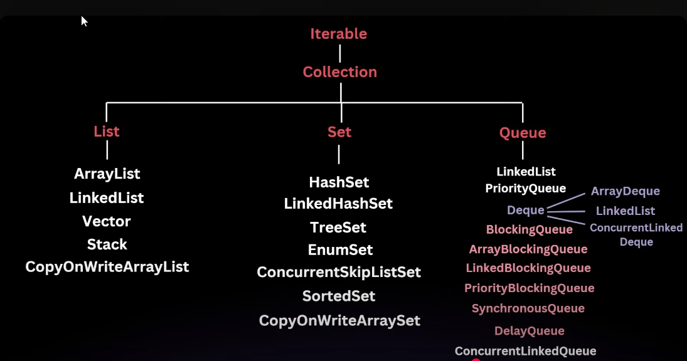
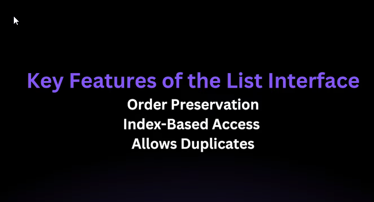

**key Features of List Interface**


Perfect ✅ Let’s cover **all topics one by one** in the format:
👉 **Functions & Complexities Table** → **Example Code**

---

## 1️⃣ **List (ArrayList & LinkedList)**

| Function    | Time Complexity                               |
| ----------- | --------------------------------------------- |
| add(e)      | O(1) amortized (ArrayList), O(1) (LinkedList) |
| remove(i/e) | O(n) (ArrayList/LinkedList)                   |
| get(i)      | O(1) (ArrayList), O(n) (LinkedList)           |
| contains(e) | O(n)                                          |
| size()      | O(1)                                          |

### Example Code

```java
import java.util.*;

public class ListDemo {
    public static void main(String[] args) {
        // ArrayList Example
        List<Integer> arrayList = new ArrayList<>();
        arrayList.add(10);        // O(1) amortized
        arrayList.add(20);
        System.out.println(arrayList.get(1)); // O(1) → 20
        arrayList.remove(0);     // O(n)
        System.out.println(arrayList.contains(20)); // O(n) → true
        System.out.println(arrayList.size()); // O(1)
        arrayList.set(0, 5); // O(1)

        // LinkedList Example
        List<Integer> linkedList = new LinkedList<>();
        linkedList.add(5);       // O(1)
        linkedList.add(15);
        System.out.println(linkedList.get(1)); // O(n) → 15
        linkedList.remove(Integer.valueOf(5)); // O(n)
        System.out.println(linkedList.contains(15)); // O(n) → true
    }
}
```

---

## 2️⃣ **Stack (Deque Implementation)**

| Function  | Time Complexity |
| --------- | --------------- |
| push(e)   | O(1)            |
| pop()     | O(1)            |
| peek()    | O(1)            |
| isEmpty() | O(1)            |

### Example Code

```java
import java.util.*;

public class StackDemo {
    public static void main(String[] args) {
        Deque<Integer> stack = new ArrayDeque<>();
        stack.push(100); // O(1)
        stack.push(200);
        System.out.println(stack.peek()); // O(1) → 200
        stack.pop(); // O(1)
        System.out.println(stack.isEmpty()); // O(1) → false
    }
}
```

---

## 3️⃣ **Queue (ArrayDeque)**

| Function  | Time Complexity |
| --------- | --------------- |
| offer(e)  | O(1) amortized  |
| poll()    | O(1)            |
| peek()    | O(1)            |
| size()    | O(1)            |
| isEmpty() | O(1)            |

### Example Code

```java
import java.util.*;

public class QueueDemo {
    public static void main(String[] args) {
        Queue<Integer> queue = new ArrayDeque<>();
        queue.offer(5);  // O(1)
        queue.offer(15);
        System.out.println(queue.peek()); // O(1) → 5
        queue.poll(); // O(1) removes 5
        System.out.println(queue.size()); // O(1) → 1
        System.out.println(queue.isEmpty()); // O(1) → false
    }
}
```

---

## 4️⃣ **PriorityQueue (MinHeap / MaxHeap)**

| Function  | Time Complexity |
| --------- | --------------- |
| offer(e)  | O(log n)        |
| poll()    | O(log n)        |
| peek()    | O(1)            |
| size()    | O(1)            |
| isEmpty() | O(1)            |

### Example Code

```java
import java.util.*;

public class PriorityQueueDemo {
    public static void main(String[] args) {
        // MinHeap (default)
        PriorityQueue<Integer> minHeap = new PriorityQueue<>();
        minHeap.offer(30); // O(log n)
        minHeap.offer(10);
        System.out.println(minHeap.peek()); // O(1) → 10
        minHeap.poll(); // O(log n)
        
        // MaxHeap
        PriorityQueue<Integer> maxHeap = new PriorityQueue<>(Collections.reverseOrder());
        maxHeap.offer(30);
        maxHeap.offer(10);
        System.out.println(maxHeap.peek()); // O(1) → 30
    }
}
```

---

## 5️⃣ **HashMap**

| Function       | Time Complexity |
| -------------- | --------------- |
| put(k,v)       | O(1) amortized  |
| get(k)         | O(1)            |
| containsKey(k) | O(1)            |
| remove(k)      | O(1)            |
| size()         | O(1)            |

### Example Code

```java
import java.util.*;

public class HashMapDemo {
    public static void main(String[] args) {
        Map<String, Integer> map = new HashMap<>();
        map.put("a", 1); // O(1)
        map.put("b", 2);
        System.out.println(map.get("a")); // O(1) → 1
        System.out.println(map.containsKey("b")); // O(1) → true
        map.remove("b"); // O(1)
        System.out.println(map.size()); // O(1) → 1
    }
}
```

---

## 6️⃣ **TreeMap**

| Function       | Time Complexity |
| -------------- | --------------- |
| put(k,v)       | O(log n)        |
| get(k)         | O(log n)        |
| containsKey(k) | O(log n)        |
| remove(k)      | O(log n)        |
| size()         | O(1)            |

### Example Code

```java
import java.util.*;

public class TreeMapDemo {
    public static void main(String[] args) {
        TreeMap<Integer, String> tmap = new TreeMap<>();
        tmap.put(2, "hi"); // O(log n)
        tmap.put(1, "hello");
        System.out.println(tmap.get(1)); // O(log n) → hello
        System.out.println(tmap.containsKey(2)); // O(log n) → true
        tmap.remove(1); // O(log n)
        System.out.println(tmap.size()); // O(1)
    }
}
```

---

## 7️⃣ **HashSet**

| Function    | Time Complexity |
| ----------- | --------------- |
| add(e)      | O(1) amortized  |
| remove(e)   | O(1)            |
| contains(e) | O(1)            |
| size()      | O(1)            |

### Example Code

```java
import java.util.*;

public class HashSetDemo {
    public static void main(String[] args) {
        Set<Integer> set = new HashSet<>();
        set.add(5); // O(1)
        set.add(10);
        System.out.println(set.contains(5)); // O(1) → true
        set.remove(10); // O(1)
        System.out.println(set.size()); // O(1) → 1
    }
}
```

---

## 8️⃣ **TreeSet**

| Function    | Time Complexity |
| ----------- | --------------- |
| add(e)      | O(log n)        |
| remove(e)   | O(log n)        |
| contains(e) | O(log n)        |
| size()      | O(1)            |

### Example Code

```java
import java.util.*;

public class TreeSetDemo {
    public static void main(String[] args) {
        TreeSet<Integer> tset = new TreeSet<>();
        tset.add(20); // O(log n)
        tset.add(15);
        System.out.println(tset.contains(20)); // O(log n) → true
        tset.remove(15); // O(log n)
        System.out.println(tset.size()); // O(1)
    }
}
```

---

✨ Done! Now you have **all major Java Collections topics** covered in the exact structure you wanted.

Would you like me to also prepare a **combined master code file** (one main class that demonstrates all DS sequentially) so you can run and revise everything in one go?
Got it ✅ — since you already have the basic **List** notes + code, here’s only the **extra part** you need to add for **Collections utility methods** and **Custom Comparator**:

---

### 🔹 Add to Code (Collections Methods + Comparator)

```java
// Collections utility methods
Collections.sort(arrayList);            // O(n log n) → Sort ascending
Collections.reverse(arrayList);         // O(n) → Reverse order
int maxVal = Collections.max(arrayList); // O(n)
int minVal = Collections.min(arrayList); // O(n)
System.out.println("Max: " + maxVal + ", Min: " + minVal);

// Custom Comparator (Descending order)
Collections.sort(arrayList, (a, b) -> b - a);
System.out.println("Sorted Desc: " + arrayList);
```

---

That’s all you need to **append under the List topic**.
For other topics (Queue, Heap, TreeMap, etc.), I’ll give just the **extra add-ons** in the same way.

👉 Do you want me to now prepare the **Stack (Deque)** with its `Collections` and comparator add-ons?


Perfect 👍 You want a **dedicated section for `Comparable`, `Comparator`, and related classes** since you’ve used them in your files.
Here’s the **notes + example code**:

---

## 🔹 Comparable vs Comparator

| Feature  | Comparable                                  | Comparator                            |
| -------- | ------------------------------------------- | ------------------------------------- |
| Package  | `java.lang`                                 | `java.util`                           |
| Method   | `compareTo(T o)`                            | `compare(T o1, T o2)`                 |
| Used for | Natural ordering (default)                  | Custom ordering (multiple ways)       |
| Affects  | The class itself implements it              | Passed separately to sort/collections |
| Example  | `Collections.sort(list)` (uses `compareTo`) | `Collections.sort(list, comparator)`  |

---

### ✅ Example Code with `Comparable` and `Comparator`

```java
import java.util.*;

// Class implementing Comparable (Natural Ordering)
class Student implements Comparable<Student> {
    int id;
    String name;
    int marks;

    Student(int id, String name, int marks) {
        this.id = id;
        this.name = name;
        this.marks = marks;
    }

    // Natural ordering → sort by id
    @Override
    public int compareTo(Student other) {
        return this.id - other.id; // ascending by id
    }

    @Override
    public String toString() {
        return id + " - " + name + " (" + marks + ")";
    }
}

public class ComparatorDemo {
    public static void main(String[] args) {
        List<Student> students = new ArrayList<>();
        students.add(new Student(3, "Aman", 85));
        students.add(new Student(1, "Rahul", 92));
        students.add(new Student(2, "Priya", 78));

        // ✅ Using Comparable (sort by id)
        Collections.sort(students);
        System.out.println("Sorted by ID (Comparable): " + students);

        // ✅ Using Comparator (custom sorting by name)
        Collections.sort(students, new Comparator<Student>() {
            @Override
            public int compare(Student s1, Student s2) {
                return s1.name.compareTo(s2.name);
            }
        });
        System.out.println("Sorted by Name (Comparator): " + students);

        // ✅ Using Comparator (custom sorting by marks - descending)
        Collections.sort(students, (s1, s2) -> s2.marks - s1.marks);
        System.out.println("Sorted by Marks Desc (Comparator Lambda): " + students);

        // ✅ PriorityQueue with Comparator
        PriorityQueue<Student> pq = new PriorityQueue<>((s1, s2) -> s2.marks - s1.marks);
        pq.offer(new Student(4, "Kiran", 70));
        pq.offer(new Student(5, "Meera", 95));
        pq.offer(new Student(6, "Vikas", 88));

        System.out.println("Top Student by Marks (PQ): " + pq.peek());
    }
}
```

---

### 🔑 Key Points to Remember:

* `Comparable` → natural order, only **one way** of sorting.
* `Comparator` → flexible, can have **multiple sorting strategies**.
* Can use **anonymous class** or **lambda** for custom comparators.
* `PriorityQueue`, `TreeSet`, `TreeMap` → heavily rely on **Comparator/Comparable**.

---